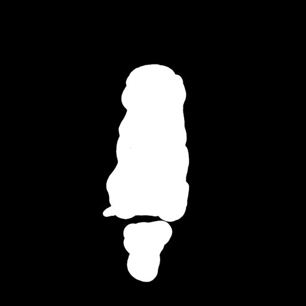

# cog-urpm-v13-inpainting

This is an implementation of inpainting using the model [invisiblecat/Uber_Realistic_Porn_Merge_V1.3_inpainting]([https://huggingface.co/invisiblecat/Uber_Realistic_Porn_Merge_V1.3_inpainting](https://huggingface.co/invisiblecat/Uber_Realistic_Porn_Merge_V1.3_inpainting/blob/main/urpm-inpainting.safetensors) as a Cog model. [Cog packages machine learning models as standard containers.](https://github.com/replicate/cog)

First, download the pre-trained weights:

    cog run script/download-weights

Then, you can run predictions:

    cog predict -i image=@demo.png -i mask=@mask.png

## Example:

Input - "a tabby cat, high resolution, sitting on a park bench"

Output:

